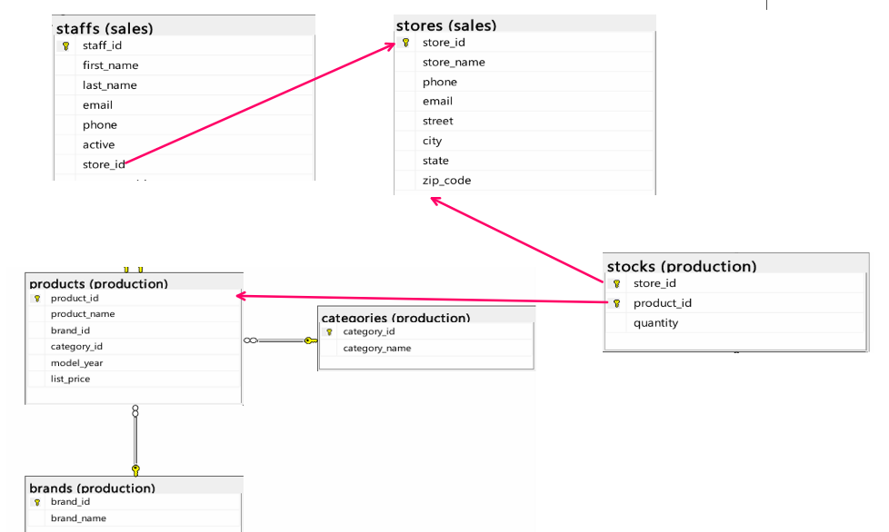

# INF272 EF-Code First MVC Application

This assignment demonstrates how to apply the concepts learned in Entity Framework by using the **Code First** approach to build an ASP.NET MVC application. The assignment involves creating models based on a given database design and generating the necessary database context and controllers.

## Project Overview

You will use the provided database design to create an MVC application that interacts with a database using the Entity Framework (EF) Code First approach. Follow the steps below to complete the project.

### Steps to Follow

1. **Create the Relevant Classes**  
   - Based on the provided database design, create the appropriate models for each entity in the system.
   - Ensure that each model class accurately reflects the structure and relationships in the database.

2. **Create the Database Context**  
   - Develop the database context class, which will handle the connection to the database.
   - This class will be responsible for defining the DbSet properties that correspond to each model class.

3. **Connect to the Database**  
   - Connect to the database as show in the video

4. **Scaffold Controllers**  
   - Use scaffolding to generate the controllers for each model class.
   - The scaffolding process will create the necessary CRUD (Create, Read, Update, Delete) actions for each entity.
   - After scaffolding, you may modify the generated code to suit your project requirements.

### Image of the Database Design

The image below shows the design of the database to be used in this project:

